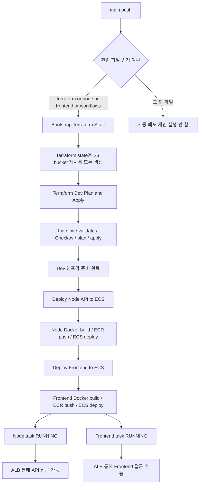

# GitHub Actions Flow

이 문서는 현재 레포 기준으로 GitHub Actions가 어떤 순서로 동작하는지 정리한 문서입니다.

대상 workflow:

- `bootstrap-terraform-state.yml`
- `terraform-dev-plan-apply.yml`
- `deploy-node-api-ecs.yml`
- `deploy-frontend-ecs.yml`
- `pull-request-security-scans.yml`

## 1. 자동 실행 조건

`main` 브랜치에 push가 들어와도 항상 전체 배포 체인이 도는 것은 아닙니다.

아래 경로 중 하나가 변경될 때 자동 체인이 시작됩니다.

- `terraform/**`
- `services/ecommerce-app-node/**`
- `services/frontend/ecommerce-app-frontend/frontend/**`
- `.github/workflows/**`

즉, 현재 자동 배포 체인은 `Terraform`, `Node API`, `Frontend`, `workflow 설정`이 바뀔 때 시작됩니다.

## 2. 전체 흐름 그림

## 3. push 후 실제로 일어나는 일

### 3-1. Bootstrap Terraform State

가장 먼저 `bootstrap-terraform-state.yml`이 실행됩니다.

이 단계의 목적은 Terraform remote state를 저장할 S3 bucket을 준비하는 것입니다.

하는 일:

1. 코드 checkout
2. AWS OIDC 인증
3. 기존 state bucket이 있으면 재사용
4. 없으면 `terraform/bootstrap` 실행
5. state bucket 이름 결정

결과:

- Terraform이 사용할 S3 state bucket이 준비됩니다.
- 다음 workflow가 같은 bucket을 찾아서 사용합니다.

### 3-2. Terraform Dev Plan and Apply

Bootstrap이 성공하면 `terraform-dev-plan-apply.yml`이 이어서 실행됩니다.

이 단계의 목적은 dev 인프라를 실제로 만들거나 수정하는 것입니다.

하는 일:

1. 코드 checkout
2. AWS OIDC 인증
3. state bucket 탐색
4. `TF_VAR_DB_PASSWORD` secret 확인
5. `backend.hcl` 생성
6. `terraform fmt -check`
7. `terraform init`
8. `terraform validate`
9. Checkov IaC 스캔
10. `terraform plan`
11. 조건이 맞으면 `terraform apply`

이 단계에서 만들어지거나 갱신되는 대표 리소스:

- VPC / Subnet / Route
- Security Group
- ALB
- ECS Cluster / Service / Task Definition
- ECR Repository
- RDS
- EFS
- CloudWatch Log Group

중요:

- Checkov는 현재 `soft_fail: true`라서 보안 경고만으로 workflow 전체가 멈추지는 않습니다.
- 실제 중단은 보통 `terraform apply` 실패일 때 발생합니다.

### 3-3. Deploy Node API to ECS

Terraform이 성공하면 `deploy-node-api-ecs.yml`이 이어서 실행됩니다.

이 단계의 목적은 Node API 이미지를 새로 빌드하고, ECS에 새 컨테이너를 띄우는 것입니다.

하는 일:

1. 코드 checkout
2. Gitleaks 실행
3. AWS OIDC 인증
4. ECR 로그인
5. Docker 이미지 빌드
6. Trivy 이미지 스캔
7. ECR에 이미지 push
8. 현재 ECS task definition 다운로드
9. 새 이미지 SHA로 task definition 갱신
10. ECS service deploy
11. 필요하면 desired count를 1로 올림

### 3-4. Deploy Frontend to ECS

Node 배포와 같은 방식으로 `deploy-frontend-ecs.yml`도 이어서 실행됩니다.

이 단계의 목적은 Frontend 이미지를 새로 빌드하고, ECS에 새 컨테이너를 띄우는 것입니다.

하는 일:

1. 코드 checkout
2. Gitleaks 실행
3. AWS OIDC 인증
4. ECR 로그인
5. Frontend Docker 이미지 빌드
6. Trivy 이미지 스캔
7. ECR에 이미지 push
8. 현재 ECS task definition 다운로드
9. 새 이미지 SHA로 task definition 갱신
10. ECS service deploy
11. 필요하면 desired count를 1로 올림

## 4. ECR 이미지가 언제 컨테이너가 되나

이 부분이 가장 중요합니다.

`ECR push`는 이미지를 저장한 것뿐이고, 아직 실행은 아닙니다.

실제로 컨테이너가 되는 순서는 이렇습니다.

1. Docker 이미지 빌드
2. ECR 저장
3. ECS task definition이 새 이미지를 가리키도록 변경
4. ECS service가 새 task를 실행
5. task가 `RUNNING` 상태가 됨
6. ALB가 그 task로 트래픽 전달

즉, 사용자가 접근 가능한 시점은 `ECR push 완료`가 아니라 `ECS task RUNNING + ALB 연결 완료` 이후입니다.

## 5. 사용자는 어디로 접근하나

사용자는 ECR이나 ECS에 직접 붙는 것이 아닙니다.

실제 접근 순서:

1. 브라우저 또는 API 클라이언트
2. ALB DNS
3. ALB Listener / Target Group
4. ECS Service
5. ECS Task 안의 컨테이너

즉, 최종 접근 지점은 ALB DNS입니다.

## 6. PR일 때는 어떻게 다른가

Pull Request에서는 배포 체인 대신 보안 검사 중심으로 동작합니다.

`pull-request-security-scans.yml`에서 하는 일:

1. Gitleaks
2. Trivy IaC
3. Trivy SCA
4. Checkov

그리고 Terraform 관련 변경이 있는 PR이면 Terraform workflow에서 `plan`까지 확인할 수 있습니다.

운영성 리소스를 실제로 변경하는 `apply`와 ECS 배포는 PR에서는 하지 않는 흐름입니다.

## 7. 현재 자동 배포 대상

현재 자동 배포 대상:

- `api-node`
- `frontend`

현재 자동 배포 비대상:

- `api-python`
- `api-spring`

## 8. 현재 구조에서 주의할 점

Frontend 자동 배포는 추가됐지만, 프론트 애플리케이션의 API 연결 방식은 별도 애플리케이션 설정 점검이 필요할 수 있습니다.

즉, 이미지가 ECS에 정상 배포되어도 프론트가 어떤 API 주소를 바라보는지는 애플리케이션 설정과 nginx 설정까지 같이 확인해야 합니다.

## 9. 배포가 성공했는지 확인하는 방법

확인 순서는 아래가 가장 빠릅니다.

1. GitHub Actions에서 4개 workflow success 확인
2. ECS service가 정상인지 확인
3. ECS task가 `RUNNING`인지 확인
4. ALB DNS 확인
5. Frontend와 API health check 확인

## 10. 한 줄 요약

현재 구조는 아래 한 줄로 이해하면 됩니다.

`main push -> state bucket 준비 -> Terraform으로 인프라 구성 -> Node/Frontend 이미지 build/push -> ECS에서 컨테이너 실행 -> ALB로 외부 접근`
